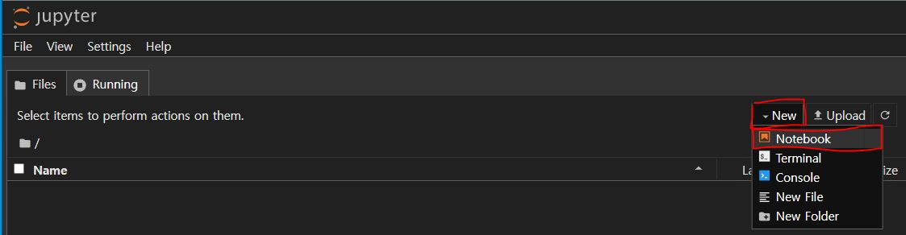
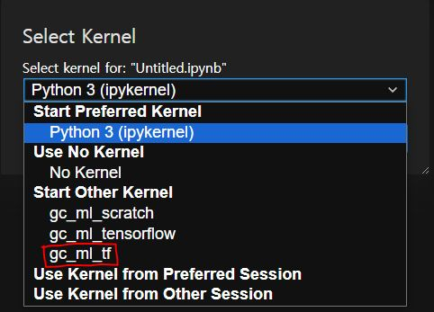

# 1. conda 생성 및 기본 설정
```cmd
REM create conda environment
conda create -n gc_ml_tf python=3.9

REM mkdir gc_ml_tf and move on
mkdir C:\gc_ml_tf && cd C:\gc_ml_tf

REM activate the gc_ml_tf env
conda activate gc_ml_tf

REM gc_ml_tf is activated!
REM 이후 과정들은 gc_ml_tf environment가 activated인 상태에서 진행
(gc_ml_tf) C:\gc_ml_tf>

REM install basic libraries for Machine Learning
(gc_ml_tf) conda install jupyter pandas matplotlib seaborn scikit-learn -y

REM (중요!!) ipython kernel을 conda environment로 지정하기
(gc_ml_tf) conda install ipykernel
(gc_ml_tf) ipython kernel install --name gc_ml_tf --user
```


# 2. cuda 및 tensorflow 설치
```cmd
REM install the cuda(for using gpu on tensorflow)
(gc_ml_tf) conda install -c conda-forge cudatoolkit=11.2 cudnn=8.1.0

REM install the tensorflow
(gc_ml_tf) pip install --upgrade pip
REM 2.10 이하 version의 tensorflow는 GPU 사용을 지원하지 않음
(gc_ml_tf) pip install "tensorflow<2.11"
```

*설치확인*  
```cmd
REM CPU 사용 가능 확인
(gc_ml_tf) python -c "import tensorflow as tf; print(tf.reduce_sum(tf.random.normal([1000, 1000])))"

REM 다음과 같이 리턴되면 성공. 마지막의 tf.Tensor(어쩌고저쩌고)가 중요함
2024-08-12 21:16:17.970580: I tensorflow/core/platform/cpu_feature_guard.cc:193] This TensorFlow binary is optimized wit
h oneAPI Deep Neural Network Library (oneDNN) to use the following CPU instructions in performance-critical operations:
 AVX AVX2
To enable them in other operations, rebuild TensorFlow with the appropriate compiler flags.
2024-08-12 21:16:18.442017: I tensorflow/core/common_runtime/gpu/gpu_device.cc:1616] Created device /job:localhost/repli
ca:0/task:0/device:GPU:0 with 3933 MB memory:  -> device: 0, name: NVIDIA GeForce RTX 2060, pci bus id: 0000:01:00.0, co
mpute capability: 7.5
tf.Tensor(1024.2958, shape=(), dtype=float32)
```

```cmd
REM GPU 사용 가능 확인
(gc_ml_tf) python -c "import tensorflow as tf; print(tf.config.list_physical_devices('GPU'))"

REM 다음과 같이 리턴되면 성공.
[PhysicalDevice(name='/physical_device:GPU:0', device_type='GPU')]
```


# 3. Jupyter Notebook에서 사용하는 방법
```cmd
REM jupyter notebook 실행
(gc_ml_tf) jupyter notebook

REM 다음 사진 참고하여 노트북 생성
```
  
*notebook file 생성*  
*다음 사진 참고하여 생성한 notebook의 kernel을 'gc_ml_tf'로 설정*  

  
*kernel을 'gc_ml_tf'로 설정*
